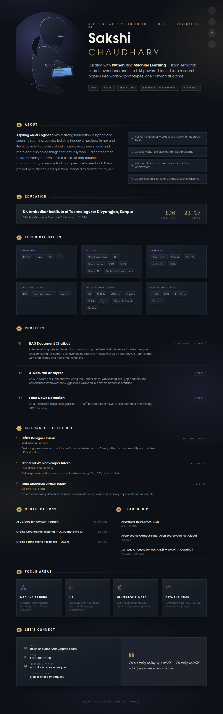

  

  
  
  
  
  
  

  

---

### 🚀 About Me

I'm an aspiring **AI/ML Engineer** with a strong foundation in Python and Machine Learning, actively building hands-on projects in **NLP and Generative AI** (RAG, LLM APIs). I love applying AI to solve real-world problems and keep expanding my skills through self-driven projects.

- 🎓 B.Tech, Computer Science (AI & ML) — Dr. Ambedkar Institute of Technology for Divyangjan, Kanpur · CGPA 8.16/10 · 2023–2027
- 🔭 Currently a **UI/UX Design Intern** at MedhaShala, designing interfaces in Figma
- 🌱 Currently deepening my skills in **Generative AI & LLM-based applications**
- 🤝 **Operations Head**, E-Cell Club · Open-Source Campus Lead, Open Source Connect Global
- 📫 Reach me at **sakshichaudhary9140@gmail.com**

---

### 🛠️ Tech Stack

**Languages & Core**

  
  
  
  

**Machine Learning, NLP & Data**

  
  
  
  
  
  
  

**Web**

  
  
  

**Tools & Platforms**

  
  
  
  
  
  
  
  

---

### 💼 Featured Projects

<table>
  <tr>
    <td width="33%">
      <b>🤖 <a href="https://github.com/sakshi-chaudhary91/rag-document-chatbot">RAG Document Chatbot</a></b> 
      RAG chatbot using Gemini API, Sentence Transformers &amp; FAISS for semantic search over PDFs, deployed as an interactive Streamlit app. 
      <a href="https://YOUR-DEMO-LINK.streamlit.app">🔗 Live Demo</a>
    </td>
    <td width="33%">
      <b>📄 <a href="https://github.com/sakshi-chaudhary91/ai-resume-analyzer">AI Resume Analyzer</a></b> 
      ATS scoring, skill-gap analysis, and Gemini API-powered personalized resume recommendations via a Streamlit interface.
    </td>
    <td width="33%">
      <b>📰 <a href="https://github.com/sakshi-chaudhary91/fake-news-detection">Fake News Detection</a></b> 
      NLP classifier (Logistic Regression + TF-IDF) achieving <b>94% accuracy</b> on real-world news data.
    </td>
  </tr>
</table>

---

### 🏆 Certifications

  
  
  

---

### 📊 GitHub Stats

  
  

  

---

  

