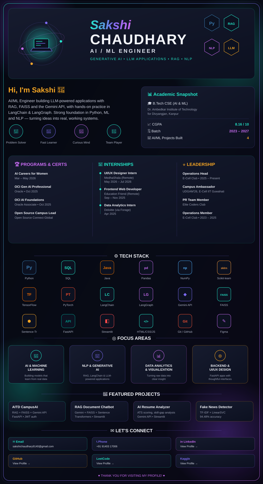

  

  
  
  
  
  
  

  

---

### 🚀 About Me

I'm an **AI/ML Engineer** building **LLM-powered applications** with RAG, FAISS, Sentence Transformers and the Gemini API, backed by a strong foundation in Python, Machine Learning and NLP. I love applying AI to solve real-world problems and keep expanding my skills through self-driven projects.

- 🎓 B.Tech, Computer Science (AI & ML) — Dr. Ambedkar Institute of Technology for Divyangjan, Kanpur · CGPA 8.16/10 · 2023–2027
- 🔭 Oracle-certified in **Generative AI** · Completed a UI/UX Design Internship at MedhaShala (Figma)
- 🌱 Currently practising **LangChain & LangGraph** to build multi-step LLM workflows
- 🤝 **Operations Head**, E-Cell Club · Open-Source Campus Lead, Open Source Connect Global
- 📫 Reach me at **sakshichaudhary9140@gmail.com**

---

### 🛠️ Tech Stack

**Languages & Core**

  
  
  
  

**Generative AI & LLMs**

  
  
  
  
  
  

**Machine Learning, Deep Learning & Data**

  
  
  
  
  
  
  
  

**Backend & Deployment**

  
  
  
  

**Web**

  
  
  

**Tools & Platforms**

  
  
  
  
  
  

---

### 💼 Featured Projects

<table>
  <tr>
    <td width="50%">
      <b>🎓 <a href="https://github.com/sakshi-chaudhary91/AITD-CampusAI">AITD CampusAI</a></b> 
      RAG-based campus assistant with PDF upload, chunking and semantic search using FAISS &amp; Sentence Transformers, answers via Gemini API, and a FastAPI backend secured with JWT authentication.
    </td>
    <td width="50%">
      <b>🤖 <a href="https://github.com/sakshi-chaudhary91/RAG-Document-Chatbot">RAG Document Chatbot</a></b> 
      RAG chatbot using Gemini API, Sentence Transformers &amp; FAISS for semantic search over PDFs, deployed as an interactive Streamlit app with chat history. 
      <a href="https://rag-document-chatbot-91.streamlit.app/">🔗 Live Demo</a>
    </td>
  </tr>
  <tr>
    <td width="50%">
      <b>📄 <a href="https://github.com/sakshi-chaudhary91/AI-Resume-Analyzer">AI Resume Analyzer</a></b> 
      ATS scoring, skill-gap analysis, and Gemini API-powered personalized resume recommendations via a Streamlit interface.
    </td>
    <td width="50%">
      <b>📰 <a href="https://github.com/sakshi-chaudhary91/Fake-News-Detector">Fake News Detector</a></b> 
      NLP classifier (TF-IDF + LinearSVC) achieving <b>94.48% accuracy</b>, deployed as a Streamlit app with real-time predictions and confidence scoring. 
      <a href="https://fake-news-detector-truthscan.streamlit.app/">🔗 Live Demo</a>
    </td>
  </tr>
</table>

---

### 🏆 Certifications

  
  
  

---
### 📊 GitHub Stats

  
  

  

